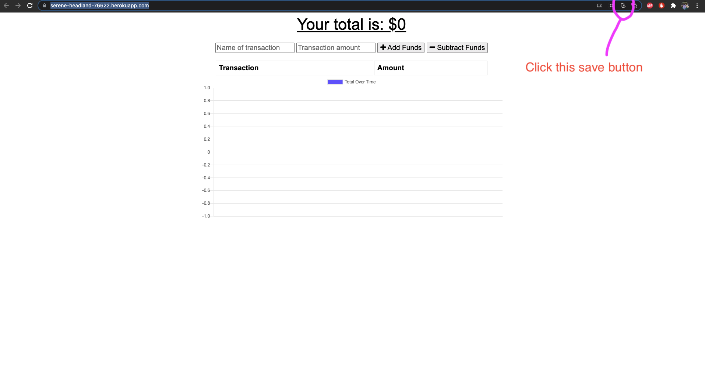

# Budget Tracker

[Delpoyed](https://serene-headland-76622.herokuapp.com/)


## Table of Contents

- [Installation](#installation)
- [Questions](#questions)

## Description:

The purpose of this project was to convert an application in to a Progressive Web Application. I did this by adding the `manifest.webmanifest` and the `service-worker.js ` files to the application.


## Installation

Steps to install the application:

### On Desktop
```
* Follow this [Link](https://serene-headland-76622.herokuapp.com/) to reach the application.

* Click on the save icon in the address bar to download the web application. See image below for the example

* Once this installation is complete you can use the it just like any other application
```

## Questions

If you have any questions, contact me via [Github](https://github.com/kcmuse), or send me an email at kcmusedev@gmail.com

## License

This project uses the MIT License